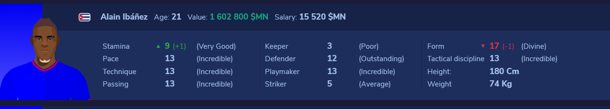
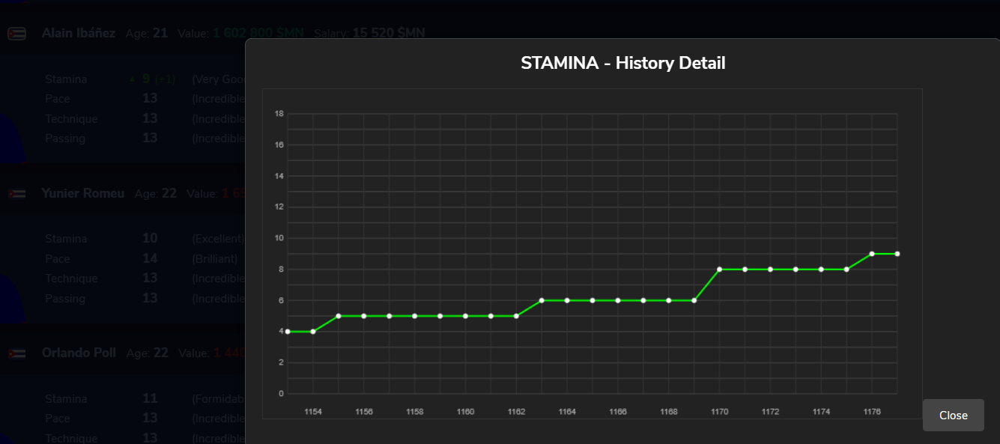
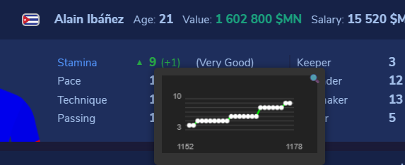
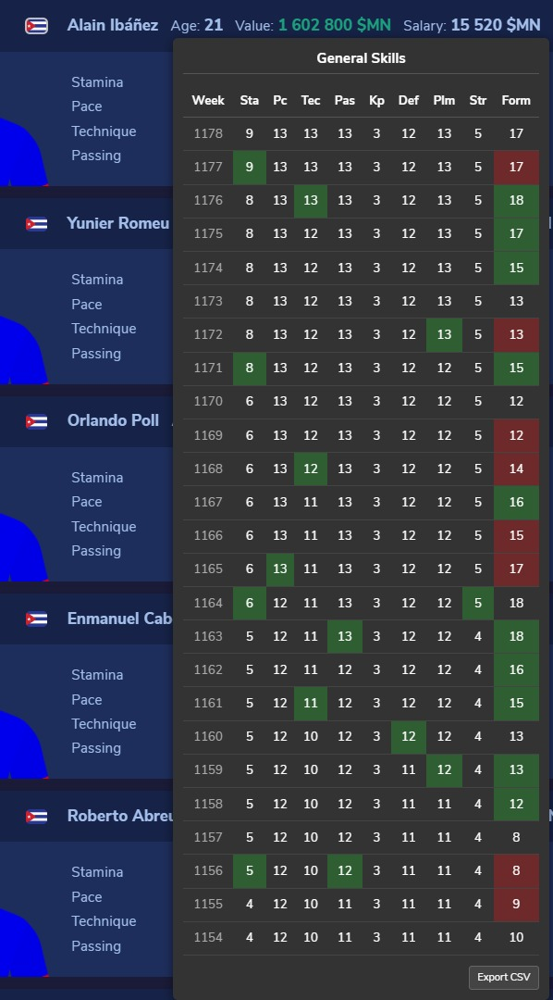

# Why Sokker++? 🚀

Sokker++ is not just another external tool; it's an **organic extension** that integrates into the very DNA of Sokker.org. It was designed with what really matters to a manager in mind: **speed, precision, and privacy**.

Here's why Sokker++ stands out from any other alternative:

---

## 1. Total Native Integration (Feels like part of the game) 🎨
**Sokker++ lives inside your browser**.
*   **Goodbye Downloads:** Forget about downloading XML files week after week, wrestling with spreadsheets, or configuring complex external programs.
*   **Absolute Immediacy:** Just by installing the extension and opening Sokker, you'll have instant access to the last 15 weeks of history for every player. **You don't need to have downloaded the data beforehand.**
*   **Zero Configuration:** you don't need to enter your username or password on any strange site. Sokker++ uses your active session securely and transparently.
*   **Smart Visualization:**
    *   Evolution charts appear integrated into the player table itself just by hovering your mouse.
    
    

    *   Want details? Clicking on a skill opens an enlarged and precise chart.
    
    

    *   Improvement arrows (▲/▼) are drawn next to the real values so you can see progress at a glance.
    
    

    *   **NEW: Skills History (General Skills):**
    *   Hover over the **player's name** to see a full table with the weekly evolution of all skills.
    *   Changes are automatically highlighted: **Green** for improvements, **Red** for drops.
    
    

*   **Native Design:** The aesthetics respect the Sokker style 100%. **You won't feel like it's a plugin; you'll feel like the game has evolved.**

---

## 2. Privacy and Portability 🔒
*   **Your data is yours.** Sokker++ does not send your players' information to third-party servers, shared databases, or hidden trackers.
*   All the magic happens locally in your browser. You can rest easy knowing your strategy and future stars are state secrets.
*   **Magical Portability:** If you switch computers, **you don't need to copy files or databases**. Simply install the extension on the new machine and open Sokker. The extension will automatically reconstruct history by reading the available data in the game. It's that easy!

---

## 3. Ultralight Performance ⚡
We've optimized every line of code so the extension is invisible in terms of performance.
*   It doesn't slow down page loading.
*   It doesn't consume unnecessary memory.
*   It only activates when needed (in the squad view), keeping the rest of the game fluid.

---

### In Summary:
Sokker++ transforms Sokker into the modern version you always wanted, respecting the essence of the classic game but giving you the power of modern data. **It's Sokker, but with superpowers.**

---

### ⚠️ IMPORTANT NOTE ABOUT PLUS
Sokker++ is an incredible complementary tool, but **it does not replace the official Plus subscription**. If you are a Plus user (like me), I genuinely recommend that you continue supporting the game by maintaining your subscription. Sokker++ boosts your experience; it doesn't replace support for Sokker.org's development.

Final Note: In due time, Sokker++ will be available in the Chrome and Edge extension stores. The Chrome Store fee is already paid, but there are many forms to fill out before it's available to all users.

[by manuel.team](https://manuel.team)
